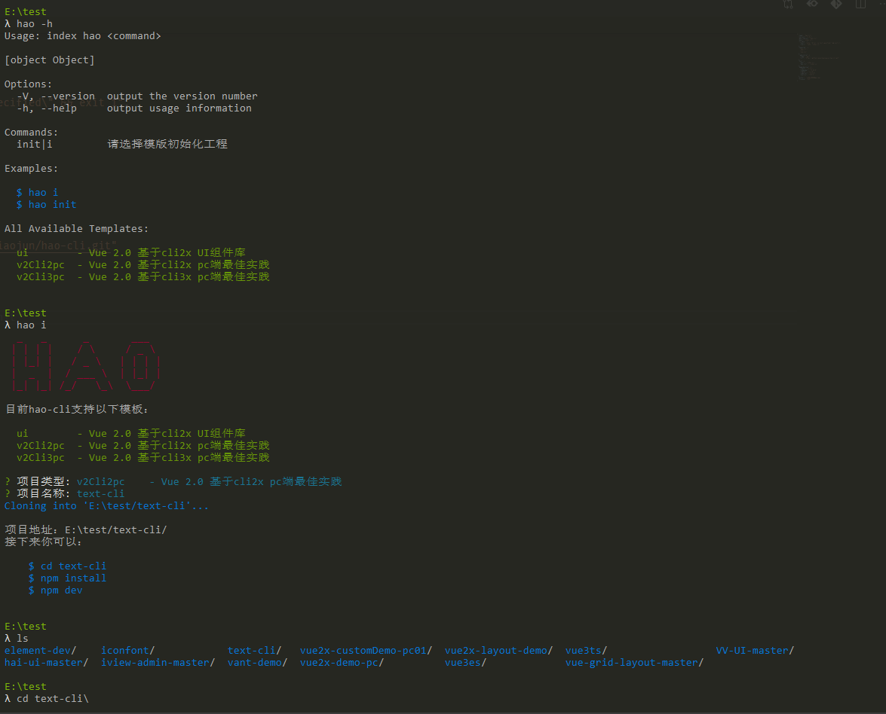

# hao-cli  嗨！o(*￣︶￣*)o

> DRY（Don't repeat yourself）一个简单cli 避免更多的重复


### 安装

```bash
npm install hao-cli -g
```

### 使用

 
 
如果对您有帮助，欢迎start，有问题，欢迎issues

### 参考

[https://www.cnblogs.com/skylor/p/9662550.html](https://www.cnblogs.com/skylor/p/9662550.html)

